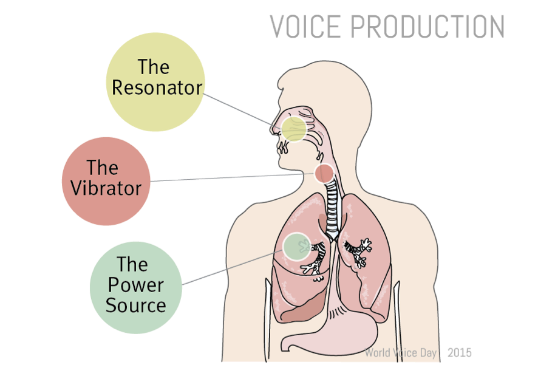
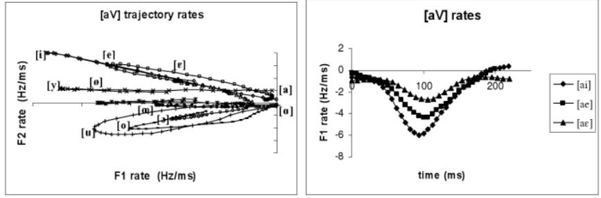

<!--

-->

 
## "Dynamic parameter for independent speaker speech recognition engine" 
1. Speech fundamentals
2. Static vs. Dynamic parameters 
3. Dynamic  features for indedepent speaker
4. State of the art 
<!---->

# 1. Speech Fundamentals

## 1.1. Speech Production 

 Speech is the result of combination of articulatory gestures and energy. 

<!--[link](https://epfl.ch)

	*italic*

**bold**

* Unordered list
* ...

1. Ordered list
2. ... 

> * Incremental list
* (also works for ordered lists)

## {.slide: data-background="media/background.gif"}
-->

## 1.2. Source Filter theory

## 1.3. Formants  

<!---->

Strange (1989) proved that with only the first 2 formants, vowel identification can be achieve

<!---## 1.3. Formants 

-->
# 2. Static vs. Dynamic 

## 2.1 Static Speech Features 

<ul style="font-size:70%;">
 <li>Linear Predictive Coding (LPC): Based on a mathematical approximation of the vocal tract. </li>
 <li>Mel Frequency Cepstrum Coeficient (CFCC): Based on human hearing perceptions.</li>
</ul>

 
<!--
## {.slide: data-background="media/wave.gif"}
Dynamic Aspects: Nonlinearity and context dependent
 -->

## 2.2 Dynamic aspect
<ul style="font-size:70%;">
 <li> The conventional linear approaches neglets dynamic structures known to be present in speech.  </li>
 <!-- -->
 <li> Context dependent</li>
</ul>

## 2.3 Dynamic of Consonant 
 <ul style="font-size:70%;">
 <li> Tuller, Case, Ding & Kelso 1994: Stay-Say continuum </li>
 <li> Nguyen, Lancia, Bergounioux, Wauquier-Gravelines & Tuller 2005: Cepe-Steppe continuum.</li>
</ul>

## 2.4 Dynamic of Vowel 
<ul style="font-size:70%;">
 <li> Peterson and Barney 1952, & Hillebrand 1995: Formants frequencies over time. </li>
 <li> Strange 1989: Perception of silent-center syllables .</li>
  <li> R. Carré & Mrayatri: natural vocalic trajectories follow specific paths .</li>
</ul>

## 2.4 Dynamic of Vowel 
<ul style="font-size:70%;">
 <li> Tran 2006 & R. Carré 2007: Vowel indentification using trajectories' rates and directions. </li>
 <li> R. Carré 2009: Vowel identification using knowledge of the point of departure and trajectory direction. </li>
 
</ul>

# 3. Dynamic  features for indedepent speaker

## 3.1 variability 
<!--* Variablitiy need to be taking seriously.-->

<ul style="font-size:70%;">
 <li> Most speech recognition engines use spectral measurements of the speech signal based on absolute frequency measurements</li> 
</ul>

## 3.2 SSCF
<ul style="font-size:70%;">
 <li> K.K. Paliwal 1998: proposed spectral subband controids as a new features and use them as supplement to cepstral features for SR. </li>
 <li> N. Poh et al 2003: suggest that SSCs are more robust to additive noise. </li>
</ul>

# 4. State of the art 

## 4.1 Modeling Dynamic features 
Tran 2006: 
<ul style="font-size:70%;">
 <li> Confirms that SSCF parameters can replace formants frequencies and act as pseudo-formants.  </li>
 <li> Proposed a new method to model acoustic and dynamic features (SSCF). </li>
</ul>

## 4.1 Modeling Dynamic features 
<ul style="font-size:70%;">

<li> Phuong 2018: Proposed an improvement in SSCF angles calculation   </li>
 <li> Debeuret 2019: Continue with Tran & Phoung 's work comparing different speech recognition methods  </li>
 </ul>

 
<!--
Results showed that SSCF angles have similar values for both male and female speakers.  
-->

<!-- \$\\ipa{a}\$ -->