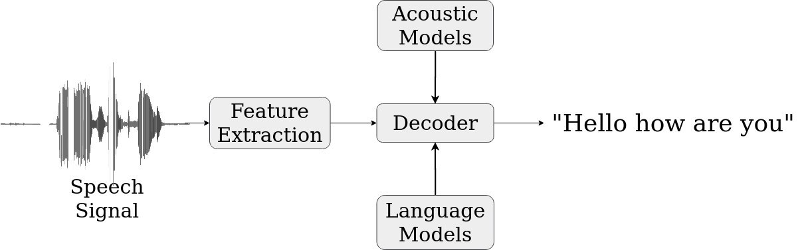
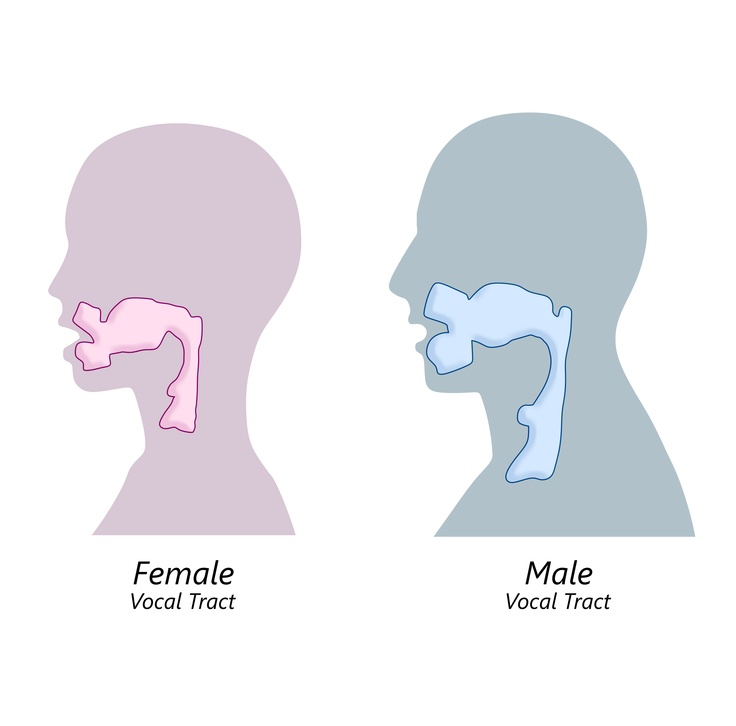
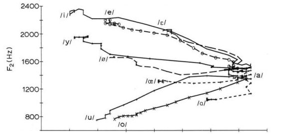
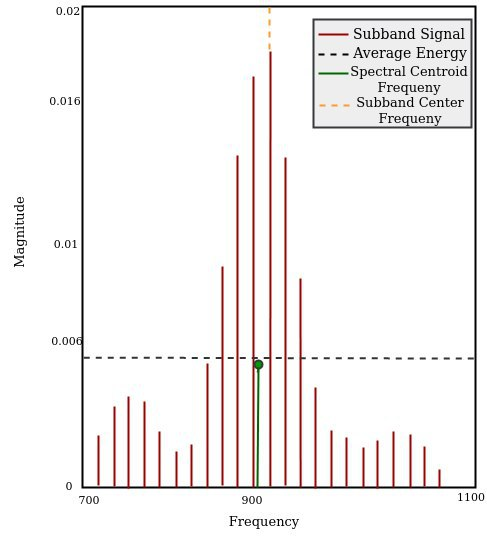
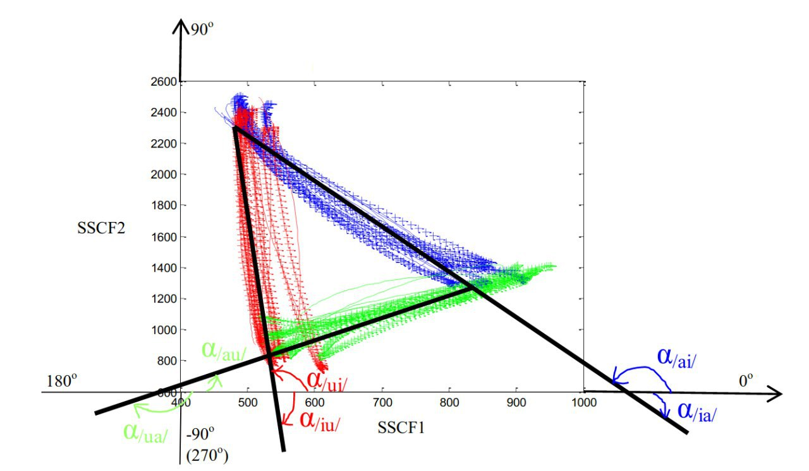
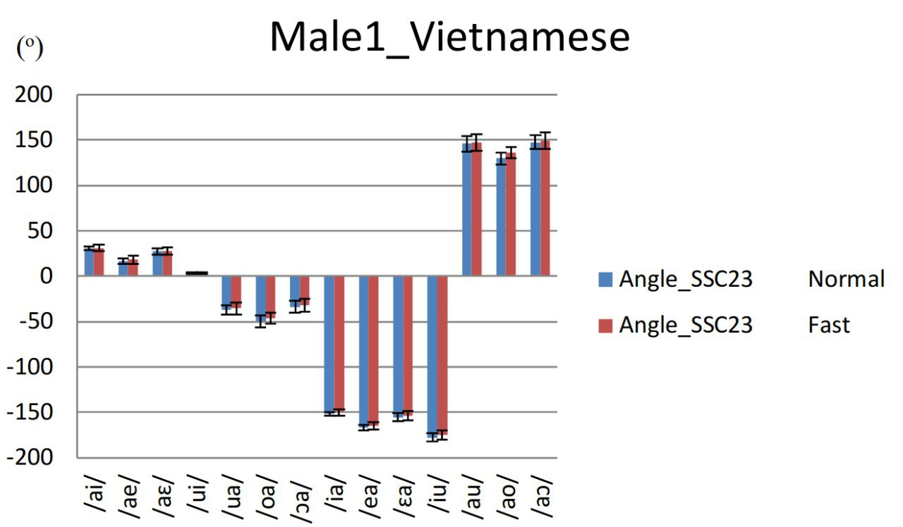
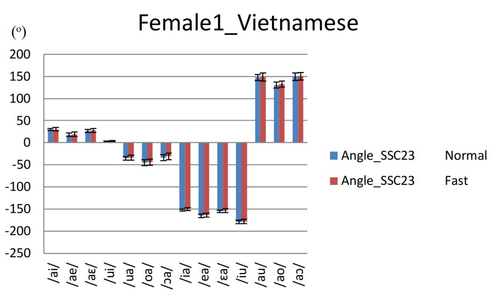
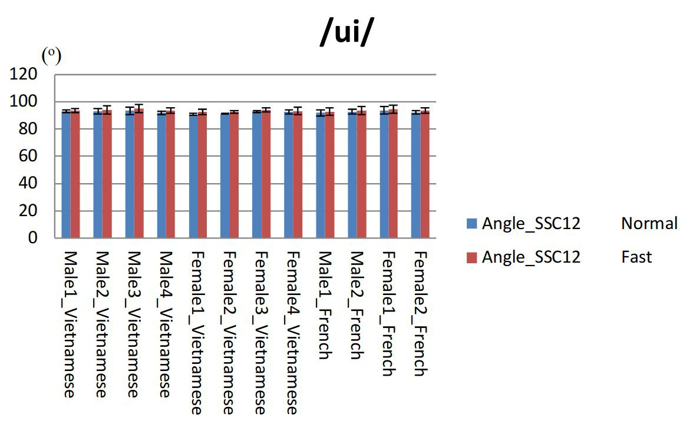

<!--

[link](https://epfl.ch)

	*italic*

**bold**

* Unordered list
* ...

1. Ordered list
2. ... 

> * Incremental list
* (also works for ordered lists)

## {.slide: data-background="media/background.gif"}
 
## "Dynamic parameter for independent speaker speech recognition engine" 
1. Speech fundamentals
2. Static vs. Dynamic parameters 
3. Dynamic  features for indedepent speaker
4. State of the art 

## 1.3. Formants 

## {.slide: data-background="media/wave.gif"}
Dynamic Aspects: Nonlinearity and context dependent
 

  -->
-->

## <h style="font-size: xxx-large;">"Dynamic parameter for independent speaker speech recognition engine"</h> 

SALGADO URIBE Ximena 

March 13,2020

#  <h style="font-size: 85%;"> 1. Speech Fundamentals </h>

## 1.1. Speech Production 

 J. Frahm et C. Rotte: IRM German speech production

	Speech is the result of combination of articulatory gestures and energy.

## 1.2. Source Filter theory

## 1.3. Formants  

	Strange (1989) proved that with only the first 2 formants, vowel identification can be achieve

# <h style="font-size: 85%;">  2. Static vs. Dynamic </h>

## 2.0 Speech Recognition System 

<!--chemin de base de la recco deep learning ou HMM nous utiliser KALDI en version deep learning (info de kaldi que thomas a utiliser) la base de donne est braf du français. -->

## 2.1 Static Speech Features 
<ul style="font-size:70%;">
	<li>Linear Predictive Coding (LPC): Based on a mathematical approximation of the vocal tract. </li>
	<li>Mel Frequency Cepstrum Coeficient (CFCC): Based on human hearing perceptions.</li>
</ul>

## 2.2 MFCC vs. Variability
<ul style="font-size:60%;">
	<li> Enviromental variability: caused by noisy surroindings, microphone characteristics. </li> 
	<li> Physiological variability: eg. female vs male vocal tract.</li>
	<li> Coarticulation: speech sound influeced by a preceding or a following speech sound. </li>
</ul>

 Watt & Fabricius 2002: Comparison of FLEECE ~ TRAP ~ GOOSE for female and male speakers. 

<!--<## 2.3 Dynamic aspect
<ul style="font-size:70%;">
 <li> The conventional linear approaches neglets dynamic structures known to be present in speech.  </li>
 
 <li> Context dependent</li>
</ul>
--> 

## 2.3 Dynamic of Consonant 
 <ul style="font-size:60%;">
 <li> Tuller, Case, Ding & Kelso 1994: English "Stay-Say" continuum </li>
 <li> Nguyen, et al. 2005: French "Cepe-Steppe" continuum.</li>
</ul>

 Praat recording to illustrate "Stay-Say" continuum. 

## 2.4 Dynamic of Vowel 
<ul style="font-size:60%;">
 <li> Peterson and Barney 1952, & Hillebrand 1995: Formants frequencies over time. </li>
 <li> Strange 1989: Perception of silent-center syllables .</li>
  <li> R. Carré & Mrayatri 1991: natural vocalic trajectories follow specific paths .</li>
</ul>

 R.Carré et Mrayatri  1991. Vocalic trajectories (a-V2) in the F1-F2 plane 

## 2.4 Dynamic of Vowel 
<ul style="font-size:60%;">
 <li>  R. Carré 2007: Vowel indentification using trajectories' rates and directions. </li>
 <li> R. Carré 2009: Vowel identification using knowledge of the point of departure and trajectory direction. </li>
</ul>

 R.Carre 2007 F1 rates in time domain for in [ai] trace. (right) 

 R.Carré & P. Divenyi 2000: temporal representation of [ai] trajectory. (left)  

# <h style="font-size: 85%;">  3. Dynamic features for indedepent speaker </h>

## 3.1 SSCF
<ul style="font-size:60%;">
 <li> K.K. Paliwal 1998: proposed spectral subband controids as a new features and use them as supplement to cepstral features for SR. </li>
 <li> N. Poh et al 2003: suggest that SSCs are more robust to additive noise. </li>
</ul>

 Kua et al. 2010: SSCF representation. 

 N. Poh et al 2003: Conventional spectrogram overlaid witth SSCF. 

## <h style="font-size: 95%;"> 3.2 Modeling Dynamic features </h>

<ul style="font-size:70%;">
	<li> Tran 2006: Confirms that SSCF parameters can replace formants frequencies and act as pseudo-formants.  </li>
</ul>

 Tran 2006. Comparison between SSCF features and formant frequencies on natural Vietnamese signal. 

## <h style="font-size: 95%;"> 3.2 Modeling Dynamic features </h>
<ul style="font-size:70%;">
	<li> Tran 2006: Proposed a new method to model acoustic and dynamic features (SSCF).  </li>
	<li> Phuong 2018: Proposed an improvement in SSCF angles calculation    </li>
</ul>

 R.Carré et al. 2004. Vocalic trajectories in the F1-F2 plane 

## <h style="font-size: 95%;"> 3.2 Modeling Dynamic features </h>

	Results showed that SSCF angles have similar values for both male and female speakers. 

## <h style="font-size: 95%;"> 3.2 Modeling Dynamic features </h>

Results showed that:

<ul>
	<li style="font-size:x-large; ">in both languages the SSCF angle12 was more or less the same. </li>
	<li style="font-size:x-large; ">different values for SSCF angle23 and SSCF angle34 </li>

<ul>
## 3.3 travail a faire 
<ul style="font-size:70%;">
	<li> Debeuret 2019: Continue with Tran & Phoung 's work comparing different speech recognition methods. </li>
</ul>

<!--
 conclusion: utiliser parametres remplacer mfcc a la entre du sisteme de reco 
thomas kaldi, rentre les angles mais les angles ne peuvent pas utiliser directement, trop bruit qui vient de la complexité de calcul
-->
 

## 3.4  What's next? & Why?  

<!--esseyer de trouver un autre parametre en combinant rapport de vitesse  et angle -->

<!-- \$\\ipa{a}\$ -->